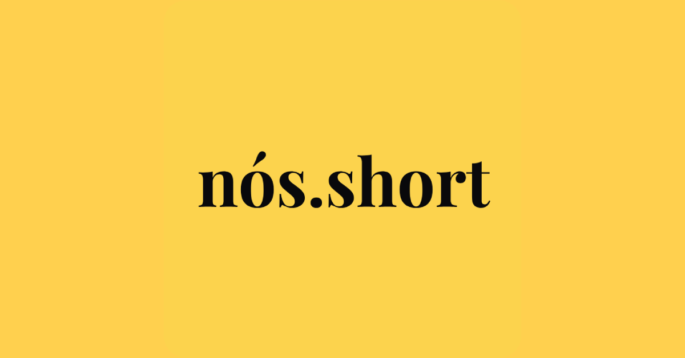

## Sobre o projeto

O nós.short é um projeto criado para o processo seletivo do [Nós - Nosso Olhar Solidário](https://nossoolharsolidario.com.br/). O projeto teve como base um design no Figma e instruções detalhadas no Notion, bem como sessões semanais de mentorias e aulas disponibilizadas aos participantes.

De forma resumida, o nós.short é um encurtador de links que utiliza a API do [url.dev](https://url.dev). O site deste repositório está disponível em [nos-short-chi.vercel.app](https://nos-short-chi.vercel.app).

O Nós é projeto de extensão da UTFPR que conecta diretamente doadores a quem precisa de ajuda. Mais informações: [página "quem somos nós"](https://nossoolharsolidario.com.br/quem-somos-nos).

## Tecnologias utilizadas

- [Typescript](https://www.typescriptlang.org/)
- [Vite](https://vitejs.dev/)
- [React](https://react.dev/)
- [Wouter](https://github.com/molefrog/wouter/)
  - Client router com API semelhante à do React Router, porém com menos recursos.
- [TailwindCSS](https://tailwindcss.com/)
- [HeadlessUI](https://headlessui.com/)
  - Utilizada para o menu de seleção da duração do link. Também seria utilizada para um menu utilizado como fallback para navegadores que não suportam a [Web Share API](https://developer.mozilla.org/en-US/docs/Web/API/Web_Share_API).

## Desafios

- [x] Adição da bibilioteca [`react-toastify`](https://fkhadra.github.io/react-toastify/introduction)
  - A biblioteca foi utilizada para o que foi proposto nos desafios e em mais alguns casos (por exemplo, para indicar ao usuário que o link está sendo encurtado).
- [x] Adição do botão para remover links
- [x] Suporte para telas menores
  - Este projeto foi desenvolvido a partir do conceito mobile-first.
- [x] Adição do input para modificar a duração dos links
- [x] Apresentar ao usuário o tempo restante para um link expirar.
- [x] Construir uma aplicação acessível
  - O site foi testado várias vezes com o leitor de tela NVDA.
- [x] Melhorar o SEO com tags semânticas e testando com o Lighthouse
- [x] Transformar a aplicação em um PWA
  - Caching de assets feito com a biblioteca [`vite-pwa`](https://vite-pwa-org.netlify.app/).
  - Botões de criação e remoção de links são desativados quando o usuário está offline.
- [x] Botão para compartilhar o link
  - Utiliza a [Web Share API](https://developer.mozilla.org/en-US/docs/Web/API/Web_Share_API).

## Notas

Queria agradecer aos organizadores do processo seletivo e a todos que participaram das mentorias. Foi tudo muito bem organizado e as mentorias ajudaram bastante (apesar do meu pequeno nervosismo antes de entrar em cada chamada). Obrigado também aos designers do projeto, não tem nada melhor do que desenvolver um app bonito :)
